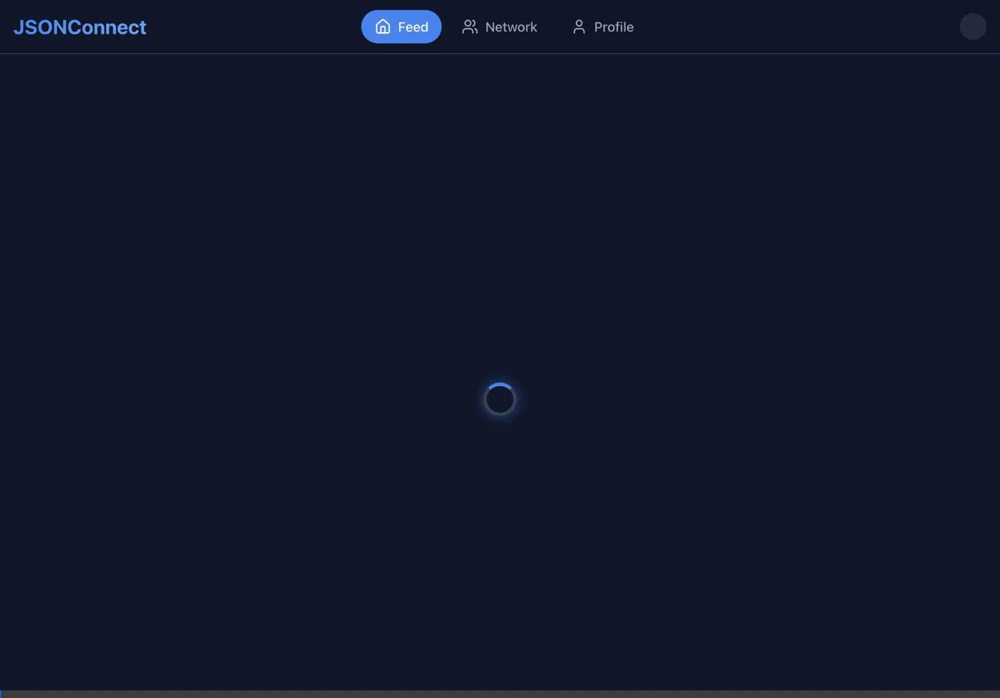

# JSONConnect: Agentic AI Frontend Showcase


**JSONConnect** is a complete web application built as an educational showcase for the capabilities of agentic AI. It acts as a unified social dashboard, interacting exclusively with the [JSONPlaceholder](https://jsonplaceholder.typicode.com/) public mock API.

This application was autonomously designed and built by **Google Antigravity**, through a process known as "Vibe Coding."

## 🎬 Demo



## 🎯 Core Concept & Features

JSONConnect transforms the disparate, raw REST resources provided by JSONPlaceholder (Users, Posts, Comments, Todos, Albums, Photos) into a cohesive, user-friendly social network interface. 

### Key Features
*   **Global Feed (`/`)**: A dynamic feed displaying all network posts. Includes a post creation form and inline, toggleable comment threads.
*   **Network Directory (`/users`)**: A visually appealing directory grid to discover other users on the platform, featuring their contact details and company information.
*   **Interactive User Profiles (`/users/:id`)**: A comprehensive, tabbed profile view for individual users containing:
    *   **Posts**: A timeline of the user's recent posts.
    *   **Todos**: An interactive, scrollable task list. 
    *   **Albums**: A stunning gallery view where album cards preview thumbnails, and clicking an album opens a full-screen, responsive photo viewer modal.

## 🏗️ Architecture & Technical Decisions

The application adheres to strict architectural constraints: **No backend services, no local databases, and direct API interaction only.**

### Technology Stack
*   **Frontend Framework**: React (scaffolded via Vite for instant HMR and optimized builds).
*   **State Management & Data Fetching**: TanStack Query (React Query). Chosen specifically for its elegant caching mechanisms and built-in support for complex optimistic UI updates.
*   **Routing**: React Router DOM for seamless Single Page Application navigation.
*   **Styling**: Vanilla CSS with CSS Modules. This ensures style encapsulation and a tailored, premium glassmorphism aesthetic without relying on external utility frameworks like Tailwind CSS.
*   **Icons**: Lucide React for clean, modern iconography.

### Optimistic UI Mutations
Because JSONPlaceholder does not actually persist state mutations (POST, PUT, DELETE), JSONConnect heavily utilizes **Optimistic UI Updates** to provide a flawless user experience.

When a user creates a post, deletes a post, or toggles a Todo status:
1.  Outgoing network refetches are immediately cancelled.
2.  The current cache state is snapshotted.
3.  The UI cache is instantly updated with the new state (e.g., the post disappears, or the checkmark appears), providing zero-latency feedback to the user.
4.  If the mock API request fails, the application seamlessly rolls back to the snapshotted state.

## 📜 Original Product Requirements Document (PRD)

This project was built based on a comprehensive PRD provided to the Antigravity agent. 
For full details, please refer to the [Product Requirements Document (PRD)](./prd.pdf).

## 📁 Project Structure

```text
src/
├── api/
│   └── client.js           # Axios configuration & mock user constants
├── components/
│   ├── domain/             # Feature-specific components (PostCard, AlbumCard, TodoItem)
│   ├── layout/             # Structural components (Navbar)
│   └── ui/                 # Shared, reusable primitives (Button, Loader, Modal)
├── hooks/                  # TanStack Query custom data hooks
│   ├── usePosts.js         # Queries/Mutations for Posts & Comments
│   ├── useUsers.js         # Queries/Mutations for Users & Todos
│   └── useAlbums.js        # Queries for Albums & Photos
├── pages/                  # Route entry points (Feed, Users, Profile)
├── App.jsx                 # App layout wrapper and Route definitions
├── main.jsx                # React root, Router, and QueryProvider setup
└── index.css               # Global CSS variables, resets, and design system tokens
```

## 🚀 Running Locally

To run this project on your local machine:

1. **Install Dependencies**
   ```bash
   npm install
   ```

2. **Start the Development Server**
   ```bash
   npm run dev
   ```

3. **Build for Production**
   ```bash
   npm run build
   ```

## ☁️ Deployment (Google Cloud Run)

This application is fully containerized and optimized for deployment to **Google Cloud Run**.

The provided `Dockerfile` uses a multi-stage build:
1. It builds the Vite/React application using a Node.js image.
2. It serves the static assets using a lightweight Nginx image. 
3. A custom `nginx.conf` ensures that React Router's client-side routing works correctly and that Nginx listens on port `8080`, which is the default port expected by Cloud Run.

### Deploying via Google Cloud CLI:
```bash
gcloud run deploy jsonconnect \
  --source . \
  --platform managed \
  --region us-central1 \
  --allow-unauthenticated
```

## 📚 References & Architectural Patterns

To learn more about the concepts and patterns utilized in this project, explore the following resources:

*   **Vibe Coding Handbook**: [http://goo.gle/itsvibecoding](http://goo.gle/itsvibecoding) - The official Google tutorial on agentic development.
*   **Optimistic UI Updates**: [TanStack Query Documentation](https://tanstack.com/query/latest/docs/framework/react/guides/optimistic-updates) - Explains how to update the UI before a mutation completes for a snappy user experience.
*   **Component-Based Architecture**: [Thinking in React](https://react.dev/learn/thinking-in-react) - Guidelines on breaking down UIs into reusable, focused components.
*   **Containerizing React Apps**: [Dockerizing a React App](https://nodejs.org/en/docs/guides/nodejs-docker-webapp/) - Best practices for building efficient Node.js Docker images.
